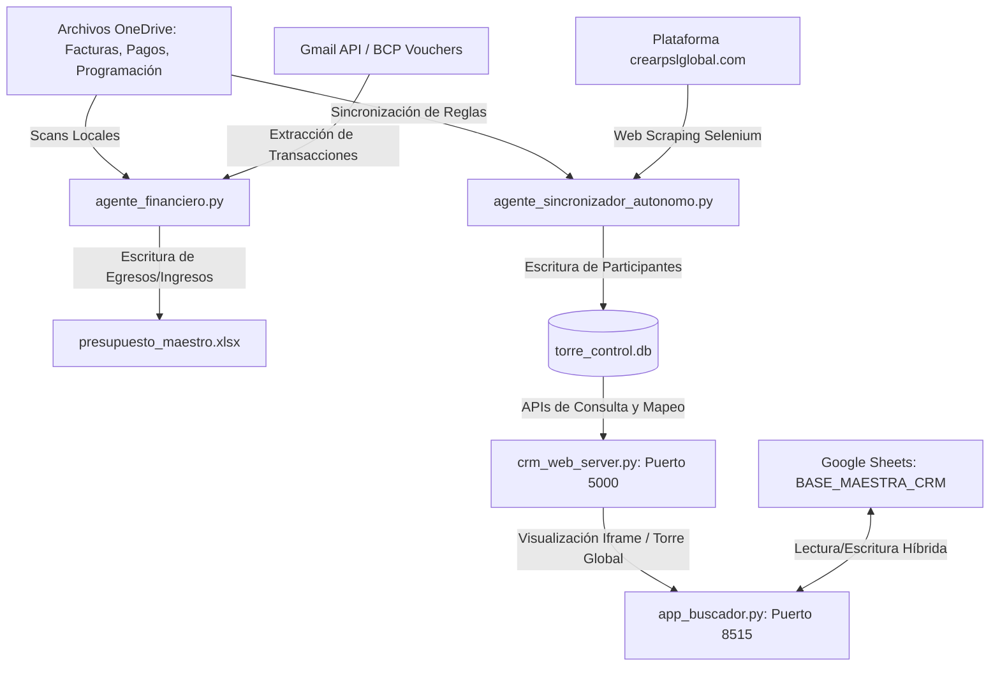

# Reporte de Arquitectura y Estructura Operativa del Bot CPSL Lima
**Ubicación de Análisis:** `C:\Users\josem\Downloads\bot-cpsl-review`
**Fecha de Generación:** 2026-06-02

Este reporte detalla la arquitectura, bases de datos, flujos de integración y las funciones de cada script ubicado en la carpeta del bot. El ecosistema está diseñado como una suite distribuida de agentes de inteligencia artificial y automatización local-nube para la gestión del CRM, finanzas, mensajería y sincronización de **Crear Poder Sin Límites (CPSL Lima)**.

---

## 1. Arquitectura General del Sistema

El bot opera como un centro de inteligencia local que coordina datos provenientes de tres fuentes principales:
1. **OneDrive:** Archivos de precios, programación de entrenamientos, manuales corporativos y vouchers de pago.
2. **Google Sheets:** Base maestra compartida con las coordinadoras (Diana, Joyce, Zuley) para control en tiempo real.
3. **Plataforma Web (Scraping):** Participantes y estatus registrados en `crearpslglobal.com`.

Toda esta información es procesada localmente y consolidada en una base de datos central en SQLite (`torre_control.db`), que alimenta el servidor web y permite al Streamlit CRM (puerto 8515) mostrar métricas unificadas.

---

## 2. Descripción de Componentes Clave

### A. Motores de Sincronización y Agentes Autónomos
*   **`agente_sincronizador_autonomo.py`**:
    *   **Función**: Monitorea de forma reactiva los archivos de OneDrive (precios, mapeo, graduados) y realiza web scraping programado cada 24 horas usando Selenium para descargar la base de datos viva de participantes desde `crearpslglobal.com`.
    *   **Destino**: Inserta y actualiza participantes en la tabla `participantes` de `torre_control.db` aplicando heurísticas para evitar duplicados y salvaguardando que no se degraden estados consolidados (ej. de `GRADUADO` a `ACTIVO`).
*   **`agente_financiero.py`**:
    *   **Función**: Procesa transacciones financieras de tres fuentes:
        1. **Facturas**: Scanea facturas y recibos PDF de la carpeta `FACTURAS` en OneDrive.
        2. **Pagos Semanales**: Parsea las planillas Excel en la carpeta `PAGOS SEMANALES` en OneDrive.
        3. **Gmail**: Descarga confirmaciones de transferencias bancarias BCP de los últimos 7 días.
    *   **Destino**: Almacena las transacciones en `presupuesto_maestro.xlsx` bajo las pestañas `Movimientos` y `Presupuestos`. Realiza una validación cruzada y emite alertas en consola si una categoría de gasto excede su límite de presupuesto mensual.
*   **`task_scheduler_v2_1.py`**:
    *   **Función**: Demonio de control y planificador de tareas en segundo plano (`APScheduler`). Automatiza ciclos recurrentes como la sincronización horaria, ejecución de pipelines de asistencia, reportes de gestión de coordinadoras y las vigilancias de bases de datos.

### B. Servidor Web y API Central
*   **`crm_web_server.py`**:
    *   **Función**: Servidor backend ligero basado en **Flask** (puerto `5000`). Expone los endpoints de datos que consumen los dashboards interactivos:
        *   `/api/dashboard-stats`: Calcula métricas operativas (Confirmados C1, C2, Desertores, Tasa de Deserción y conversión) consultando `torre_control.db`.
        *   `/api/buscar`: API de búsqueda rápida 360° de participantes.
        *   `/api/fusionar`: Ejecuta algoritmos de fusión para resolver homónimos o participantes con DNIs/Teléfonos duplicados.
        *   `/api/run-op`: Permite lanzar pipelines de mensajería (SMS o Email) directamente desde el navegador.

### C. Motores de Mensajería y Notificaciones
*   **`crear_email_core.py`** y **`campana_email_c1e28.py`**:
    *   **Función**: Motores de distribución masiva de correos electrónicos corporativos integrados con la API de Gmail. Automatizan el envío de:
        *   Cartas de bienvenida oficiales por equipo.
        *   Boarding passes informativos para entrenamientos.
        *   Alertas urgentes de vuelos e itinerarios para entrenadores.
*   **`sms_gateway.py`** y **`procesar_nuevos_rebotes_y_sms.py`**:
    *   **Función**: Pasarela local para envíos automatizados de SMS de confirmación, instrucciones de localizaciones y alertas de rebotes de correos.

### D. Agentes Vigilantes (Calidad de Datos)
*   **`agente_vigilante_graduados_completo.py`**: Monitorea la planilla de graduados oficiales y actualiza el estatus en la base de datos central para asegurar trazabilidad absoluta de la trayectoria de los participantes.
*   **`agente_vigilante_aliados_completo.py`**: Auditoría de bases de datos de aliados estratégicos y equipos coordinadores.
*   **`motor_ocr_cpsl.py`** / **`analizador_financiero_ocr.py`**: Emplean reconocimiento óptico de caracteres (OCR) para digitalizar datos desde recibos, facturas físicas y vouchers de depósito bancario.

---

## 3. Estructura de la Base de Datos (`torre_control.db`)

La base de datos SQLite central contiene las siguientes tablas principales:
1.  **`participantes`**: Almacena el perfil 360° del cliente (DNI, Nombres, Apellidos, Teléfono, Correo, Equipo, IMO Enrolador, Asistencia C1, C2, Maestría, Estado de Cuenta y Coordinador asignado).
2.  **`config_precios`**: Lista oficial de precios e inversiones en soles y dólares por tipo de entrenamiento.
3.  **`config_manuales`**: Reglas y protocolos extraídos desde los PDFs operativos para la toma de decisiones asistida por IA.
4.  **`relaciones`**: Historial de interacciones y derivaciones entre participantes, IMOs y coordinadoras.
5.  **`desertores`**: Registro detallado de cancelaciones, devoluciones y deserciones para análisis de retención.

---

## 4. Estado de los Servicios Locales en Ejecución

Para garantizar la disponibilidad total, se han levantado y estabilizado los siguientes procesos en segundo plano:

1.  **Streamlit CRM Master** (`app_buscador.py`) en puerto **`8515`**: Panel gerencial principal e interfaz del Cerebro Cuántico.
2.  **Flask Web Server** (`crm_web_server.py`) en puerto **`5000`**: Servidor de APIs y backend de Torre de Control.
3.  **Agente de Sincronización** (`agente_sincronizador_autonomo.py`): Monitoreo de OneDrive e integración web cada 60s.
4.  **APScheduler Daemon** (`task_scheduler_v2_1.py`): Control de tareas automáticas del CRM.

---
*Reporte preparado automáticamente por el Agente Maestro CPSL.*
